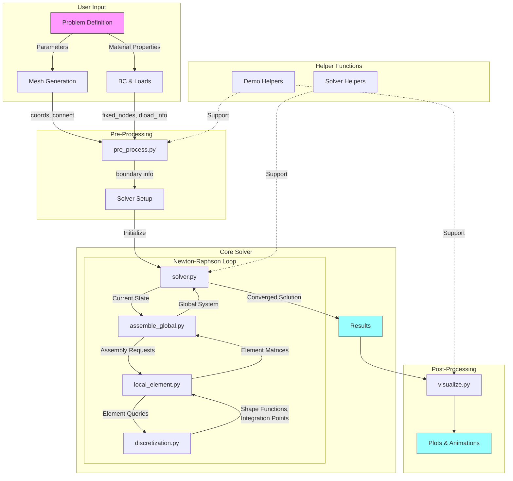

# ME_700_Assignment_3: Finite Element Analysis


## Installation and Usage

1. Clone the repository:

   ```bash
   git clone https://github.com/DVinals4721/ME_700_Assignment_3.git
   cd ME_700_Assignment_3
   ```

2. Set up a Conda environment:

   ```bash
   conda create --name fea-env python=3.12
   conda activate fea-env
   ```

   Note: You can also use mamba if you prefer.

3. Verify Python version:

   ```bash
   python --version
   ```

   Ensure it shows version 3.12 or later.

## Usage Example

After installation, explore the functionality through our example script:

### Discretization of D2_nn6_tri Element type

Open the Jupyter notebook and run each cell in order for proper performance

```bash
tutorial_discretization.ipynb
```

# Finite Element Analysis (FEA) Solver Code Overview

A Python-based implementation of a finite element solver for 2D problems, supporting various element types and nonlinear material models.

## Features

- Multiple element types supported:
  - Linear triangles (3-node)
  - Quadratic triangles (6-node)
  - Bilinear quadrilaterals (4-node)
  - Quadratic quadrilaterals (8-node)
- Nonlinear material models (e.g., Neo-Hookean)
- Newton-Raphson solver with incremental loading
- Mesh generation and visualization tools
- Performance optimization options (sparse matrix support)

## Code Structure

### Core Components

1. **Discretization (`discretization.py`)**
   - Shape functions and derivatives
   - Gaussian integration
   - Element type definitions

2. **Local Element (`local_element.py`)**
   - Element stiffness computation
   - Element residual vectors
   - Material model implementation

3. **Global Assembly (`assemble_global.py`)**
   - Global stiffness matrix assembly
   - Global residual vector assembly
   - Distributed load assembly

4. **Solver (`solver.py`)**
   - Newton-Raphson iteration
   - Incremental loading
   - Boundary condition handling

### Pre/Post Processing

1. **Mesh Generation (`pre_process.py`)**
   - Rectangular mesh generation
   - Boundary identification
   - Load and BC application

2. **Visualization (`visualize.py`)**
   - Mesh plotting
   - Deformation visualization
   - Animation generation

## Usage Example

```python
from finiteelementanalysis import pre_process as pre
from finiteelementanalysis.solver import hyperelastic_solver
from finiteelementanalysis import visualize as viz

# 1. Define problem parameters
ele_type = "D2_nn4_quad"  # 4-node quadrilateral
L, H = 10.0, 5.0         # Domain dimensions
nx, ny = 4, 2           # Mesh divisions
material_props = [134.6, 83.33]  # [mu, K] for Neo-Hookean

# 2. Generate mesh
coords, connect = pre.generate_rect_mesh_2d(ele_type, 0.0, 0.0, L, H, nx, ny)

# 3. Set boundary conditions
boundary_nodes, boundary_edges = pre.identify_rect_boundaries(
    coords, connect, ele_type, 0, L, 0, H
)
fixed_nodes = pre.assign_fixed_nodes_rect(boundary_nodes, "left", 0.0, 0.0)
dload_info = pre.assign_uniform_load_rect(boundary_edges, "right", dof_0_load=1.0)

# 4. Solve
displacements, info = hyperelastic_solver(
    material_props,
    ele_type,
    coords,
    connect,
    fixed_nodes,
    dload_info,
    nr_num_steps=5
)

# 5. Visualize
viz.make_deformation_gif(displacements, coords, connect, ele_type, "deformation.gif")
```

## Dependencies

- NumPy
- SciPy
- Matplotlib
- gmsh (optional, for complex mesh generation)

Here's a workflow diagram showing how the different components of the FEA solver interact:



Key Interactions:

1. **Input Flow**:
   - User defines problem parameters
   - Mesh is generated
   - Boundary conditions and loads are specified

2. **Pre-Processing**:
   - `pre_process.py` handles mesh and boundary setup
   - Prepares data structures for solver

3. **Core Solution**:
   - `solver.py` manages Newton-Raphson iteration
   - `assemble_global.py` builds system matrices
   - `local_element.py` computes element contributions
   - `discretization.py` provides fundamental FEA tools

4. **Post-Processing**:
   - `visualize.py` creates plots and animations
   - Results are presented to user

5. **Helper Functions**:
   - Support various stages of the workflow
   - Provide utilities for debugging and analysis

This modular structure allows for:
- Clear separation of concerns
- Easy maintenance and updates
- Flexible extension of functionality
- Efficient debugging and testing